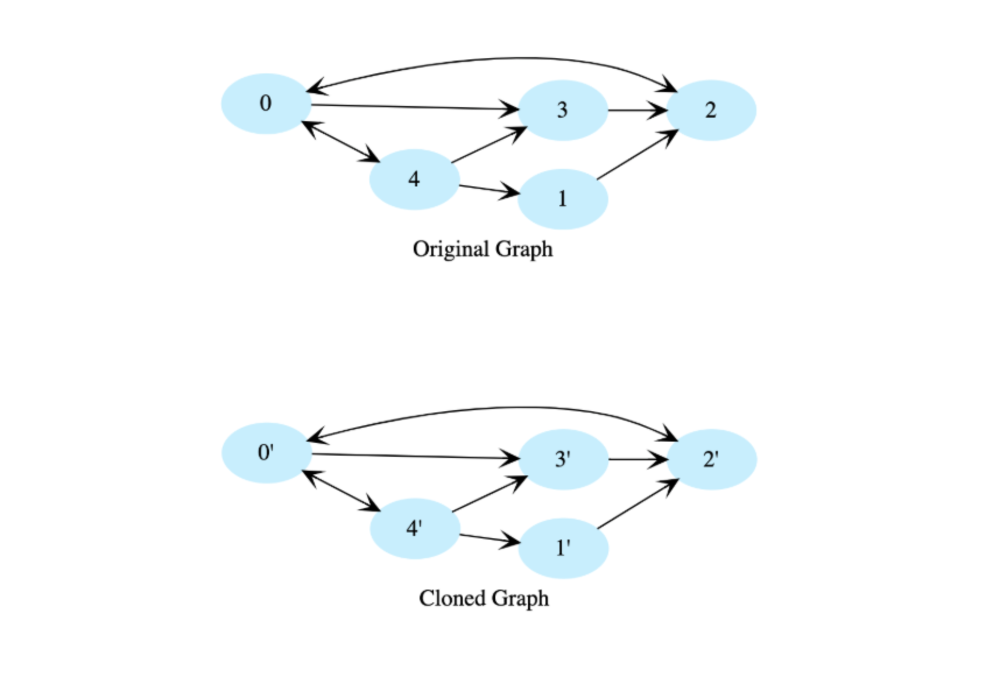

# Clone a Directed Graph

Given the root node of a directed graph, clone this graph by creating its deep
copy so that the cloned graph has the same vertices and edges as the original
graph.

Let's look at the below graphs as an example. If the input graph is _G = (E, V)_
where _V_ is set of vertides and _E_ is set of edges, then the output graph 
(cloned graph) _F' = (V', E')_ such that _V = V'_ and _E = E'_. We are assuming
that all vertices are reachable from the root vertex, i.e. we have a connected
graph.

