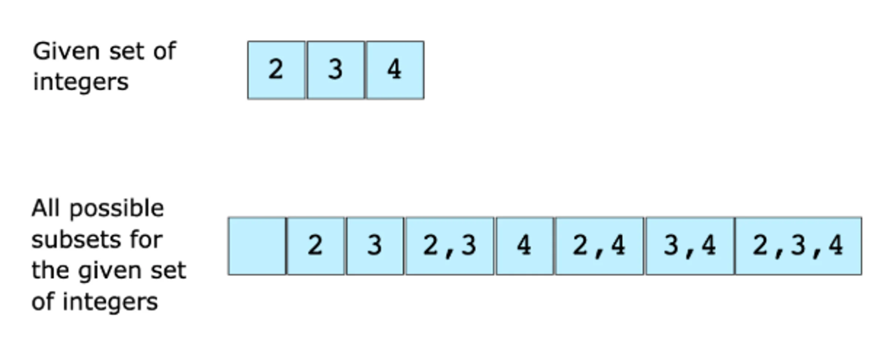

# Find All Subsets of a Given Set of Integers

We are given a set of integers and we have to find all the possible subsets of 
this set of integers. The following example elaborates on this further.

