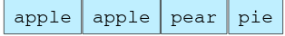
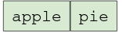
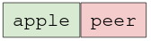

# String Segmentation

You are given a dictionary of words and a large input stirng. You have to find
out whether the input string can be completely segmented into the words of a 
given dictionary. The following two examples elaborate on the problem further.

Given a dictionary of words.

Input strng of "applepie" can be segmented into dictionary words.

Input string "applepeer" cannot be segmented into dictionary words.

