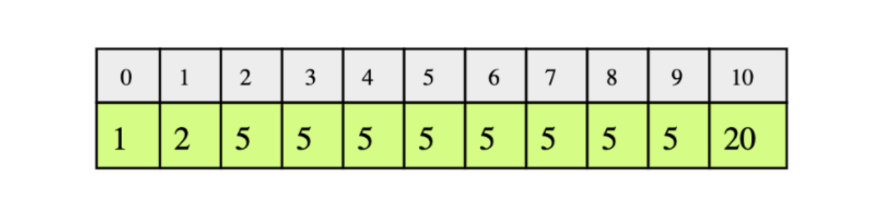

# Find Low/High Index

Given a sorted array of integers, return the low and high index of the given
key. You must return `-1` if the indexes are not found. The array length can
be in the millions with many duplicates.

In the following example, according to the `key`, the `low` and `high` indices
would be:
* `key`: 1, `low` = 0 and `high` = 0
* `key`: 2, `low` = 1 and `high` = 1
* `key`: 5, `low` = 2 and `high` = 9
* `key`: 20, `low` = 10 and `high` = 10



For the testing of toue code, the input array will be:

```java
1, 1, 1, 2, 2, 2, 2, 2, 3, 3, 3, 4, 4, 4, 4, 5, 5, 5, 6, 6, 6, 6, 6, 6
```
