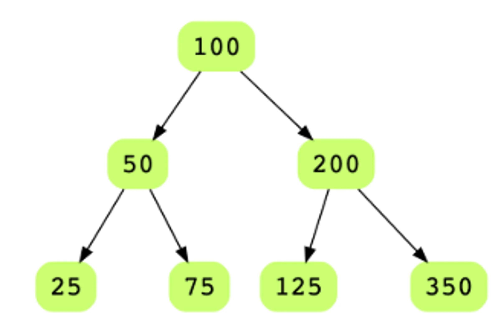
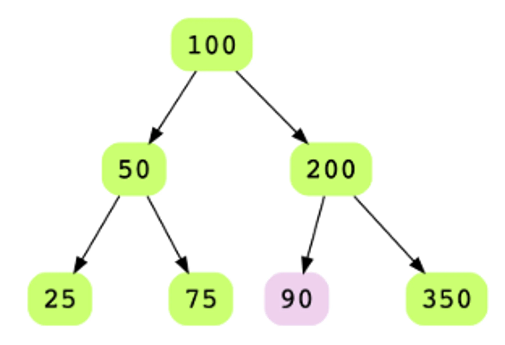

# Determine if a Binary Tree is a Binary Search Tree

Given a Binary Tree, figure out whether it is a Binary Search Tree. In a binary
search tree, each node's key value is smaller than the key value of all nodes in
the right subtree. Below is an exampple of a binary tree that is valid BST.

Below is an example of a binary tree that is not a BST.

