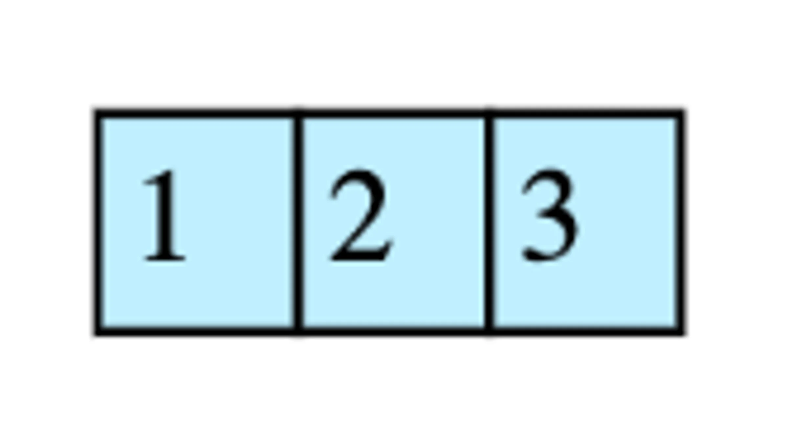
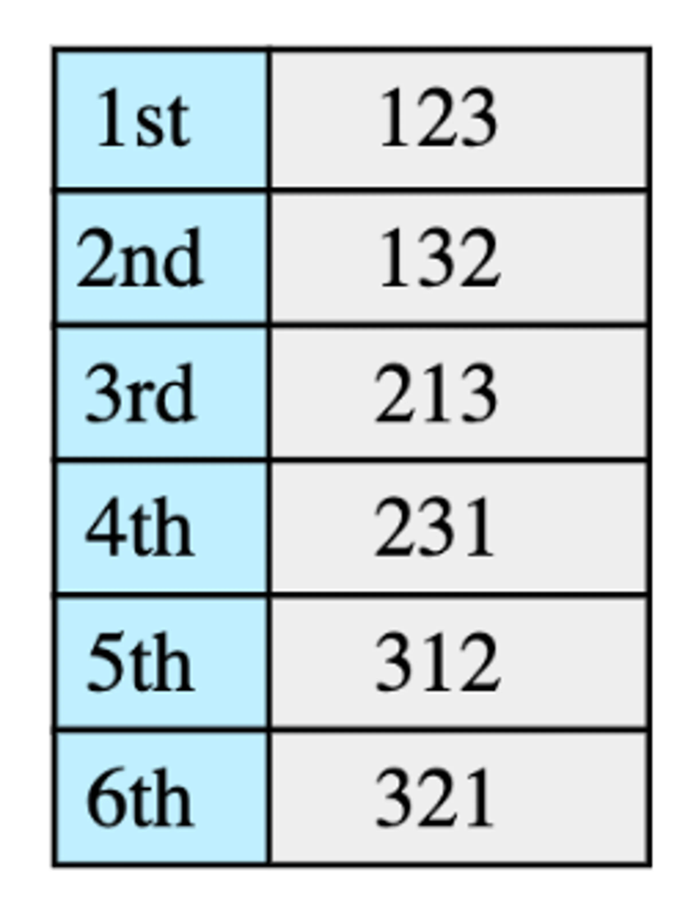

# Find Kth Permutation

Given a set  of 'n' elements, find their Kth permutation. Consider the following set of elements:

All permutatations of the above elements are (with ordering):

Here we need to find the Kth permutation.

