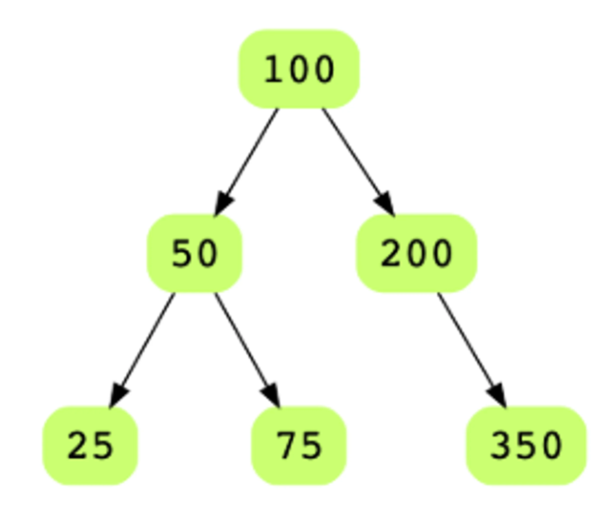

# Level Order Traversal of Binary Tree

Given the root of a binary tree, display the node values at each level. Node 
values for all levels should be displayed on separate lines. Let's take a look
at the below binary tree.

Level order traversal for this tree should look like:
* 100
* 50, 200
* 25, 75, 350
