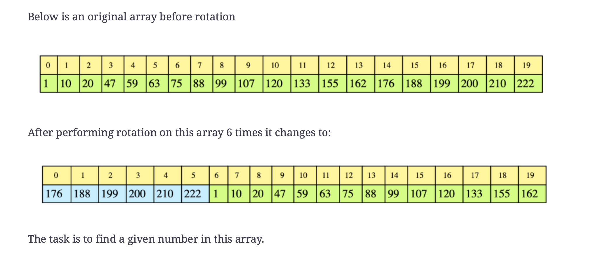

# Search Rotated Array

Search for a given number in a sorted array, with unique elements, that has been
rotated by some arbitary number. Return `-1` if the number does not exists.
Asume that the array does not contain duplicates.

