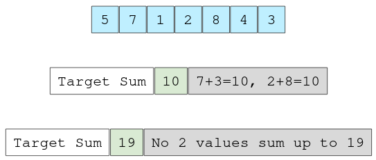

# Determine if the sum of two integers is equa to the given value.

Given an array of integers and a value, determine if there are any two integers
in the array whose sum is euqal to the given value. Return true if the sum 
exists and return false if it does not. Consider this array and the target sums:

